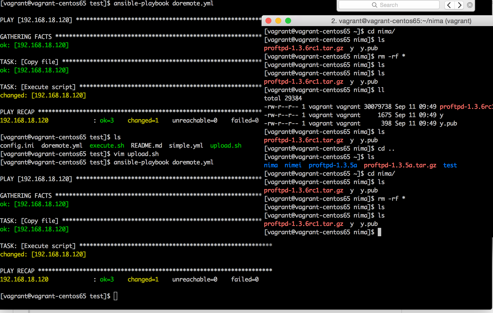

## ansible-demo
#### For what?
> Simple test for ansible remote copy and execute script

> Simple test for proftp server upload and download

> Simple test for ansible data sync

#### Result
> Proftp server install


> Remote copy and execute script result


> Copy task



> Failed task


#### Demo code
> Execute backup(Copy file to remote node and execute script)
```shell
   ansible-playbook doremote.yml
```

> Upload file via ftp
```shell
   ftp -v -n <your host> << EOF
   user <username> <password>
   binary
   <todo>
   bye
   EOF
```

#### More
Clone and modify if you needed
